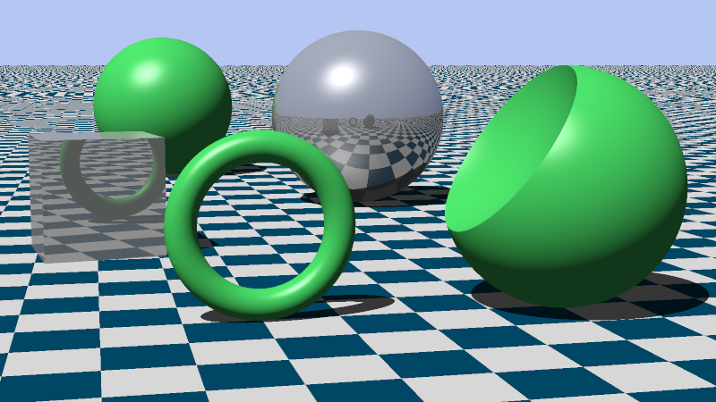

# Raytracer

A C++17 raytracer built from scratch, featuring a Phong direct-lighting model, procedural textures, and BVH acceleration.



## Features

- **Materials** — `OpaqueMaterial` with albedo, specular coefficient, shininess exponent, mirror reflection, and transparency (combinable simultaneously)
- **Lighting** — Directional light with ambient, diffuse (Lambertian), and specular (Phong) terms; hard shadows
- **Textures** — Solid color, Checker (world-space 3D), UV Checker (surface-mapped)
- **Acceleration** — Bounding Volume Hierarchy (BVH)
- **Camera** — Configurable FOV, look-at, depth of field
- **Anti-aliasing** — 4-sample fixed grid per pixel
- **Gamma correction** — γ = 2.0
- **Output** — PPM image format
- **Primitives** — Spheres, planes, finite capped cylinders (arbitrary axis orientation), triangles, arbitrarily-oriented cuboids, tori (tori of revolution, quartic ray intersection via Ferrari's method), and CSG nodes (union, intersection, difference)
- **JSON scenes** — Scene, camera, materials, and objects defined in a JSON file; no recompile needed to change the scene

## Project Structure

```
raytracer/
├── CMakeLists.txt
├── scenes/
│   └── default.json         # Scene definition (camera, lights, materials, objects)
├── third_party/
│   └── nlohmann/
│       └── json.hpp         # JSON parser (single-header, must be provided)
├── src/
│   ├── main.cpp
│   ├── core/
│   │   ├── utils.h          # Constants, random numbers, clamp
│   │   ├── vec3.h           # Vec3 / Point3 / Color + math
│   │   ├── ray.h            # Ray class
│   │   ├── color.h          # write_color utility
│   │   └── camera.h/.cpp    # Configurable camera with DoF
│   ├── geometry/
│   │   ├── aabb.h           # Axis-aligned bounding box
│   │   ├── hittable.h       # Abstract Hittable + HitRecord
│   │   ├── hittable_list.h/.cpp
│   │   ├── cuboid.h/.cpp
│   │   ├── csg.h/.cpp       # CSG boolean operations (union, intersection, difference)
│   │   ├── cylinder.h/.cpp
│   │   ├── plane.h/.cpp
│   │   ├── sphere.h/.cpp
│   │   ├── torus.h/.cpp
│   │   └── triangle.h/.cpp
│   ├── materials/
│   │   ├── material.h       # Abstract Material (get_specular, get_specular_pow, get_reflection)
│   │   └── opaque_material.h/.cpp
│   ├── textures/
│   │   ├── texture.h        # Abstract Texture
│   │   ├── solid_color.h/.cpp
│   │   ├── checker.h/.cpp
│   │   └── uv_checker.h/.cpp
│   ├── acceleration/
│   │   └── bvh.h/.cpp       # BVH tree
│   ├── scene/
│   │   └── scene_loader.h/.cpp  # Loads SceneConfig from a JSON file
│   └── renderer/
│       ├── renderer.h/.cpp  # Main render loop + Phong shading
│       └── image.h/.cpp     # PPM image output
└── output/                  # Rendered images saved here
```

## Dependencies

- CMake 3.16+, C++17 compiler
- [nlohmann/json](https://github.com/nlohmann/json) — place `json.hpp` at `third_party/nlohmann/json.hpp` before building

## Build

```bash
cmake -B build
cmake --build build
```

## Run

```bash
./build/raytracer                      # uses scenes/default.json
./build/raytracer scenes/default.json  # explicit scene path
```

Output is written to `output/render.ppm`. Open it in any PPM-capable viewer (GIMP, feh, Preview on macOS).

## Scene File

All scene data lives in `scenes/default.json`. Edit it and re-run — no recompile needed.

```json
{
  "render": {
    "width": 800,
    "aspect_ratio": [16, 9],
    "max_depth": 10,
    "sky_color": [0.5, 0.5, 0.8],
    "ambient": [0.05, 0.05, 0.05]
  },
  "light": {
    "direction": [-1.0, -2.0, -1.0],
    "color": [0.9, 0.9, 0.9]
  },
  "camera": {
    "lookfrom": [13, 2, 3],
    "lookat": [0, 0, 0],
    "vup": [0, 1, 0],
    "vfov": 20.0,
    "aperture": 0.1,
    "focus_dist": 10.0
  },
  "materials": {
    "ground": {
      "type": "opaque",
      "texture": { "type": "checker", "color1": [0.0, 0.1, 0.2], "color2": [0.9, 0.9, 0.9], "frequency": 1 },
      "specular": 0.9,
      "specular_pow": 8.0
    },
    "red_shiny": {
      "type": "opaque",
      "albedo": [0.6, 0.3, 0.2],
      "specular": 0.9,
      "specular_pow": 8.0,
      "reflection": 0.2,
      "transparency": 0.5
    }
  },
  "objects": [
    { "type": "plane",  "point": [0, 0, 0], "normal": [0, 1, 0], "material": "ground"   },
    { "type": "sphere", "center": [4, 1, 0], "radius": 1.0,       "material": "red_shiny" }
  ]
}
```

### Material fields (`"type": "opaque"`)

| Field | Default | Description |
|---|---|---|
| `albedo` | — | Base color as `[r, g, b]`; use instead of `texture` |
| `texture` | — | Procedural texture object; use instead of `albedo` |
| `specular` | `0.0` | Specular highlight intensity in [0, 1] |
| `specular_pow` | `32.0` | Phong shininess exponent (higher = tighter highlight) |
| `reflection` | `0.0` | Mirror reflection weight in [0, 1] |
| `transparency` | `0.0` | Transmission weight in [0, 1]; combinable with `reflection` |

### Object types

| Type | Fields |
|---|---|
| `"sphere"` | `"center": [x, y, z]`, `"radius"`, `"material"` |
| `"plane"` | `"point": [x, y, z]`, `"normal": [x, y, z]`, `"material"` |
| `"cylinder"` | `"center": [x, y, z]`, `"axis": [x, y, z]`, `"radius"`, `"height"`, `"material"` |
| `"triangle"` | `"p0": [x, y, z]`, `"p1": [x, y, z]`, `"p2": [x, y, z]`, `"material"` |
| `"cuboid"` | `"center": [x, y, z]`, `"u": [x, y, z]`, `"v": [x, y, z]`, `"width"`, `"height"`, `"depth"`, `"material"` |
| `"torus"` | `"center": [x, y, z]`, `"axis": [x, y, z]`, `"radius1"` (major R), `"radius2"` (tube r), `"material"` |
| `"csg"` | `"operation": "union"\|"intersection"\|"difference"`, `"left"`: object, `"right"`: object, `"material"` (propagated to children; children may override) |

### Texture types

| Type | Fields |
|---|---|
| `"solid"` | `"color": [r, g, b]` |
| `"checker"` | `"color1"`, `"color2"`, `"frequency"` — tiles in world-space XYZ |
| `"uv_checker"` | `"color1"`, `"color2"`, `"tiles_u"`, `"tiles_v"` — tiles in surface UV space |

## Third-Party Licenses

- **nlohmann/json** — MIT License, Copyright (c) 2013-2022 Niels Lohmann. See https://github.com/nlohmann/json/blob/develop/LICENSE.MIT

## Development

Built with assistance from [Claude Code](https://claude.ai/code) (Anthropic).

## References

- [_Ray Tracing in One Weekend_](https://raytracing.github.io/books/RayTracingInOneWeekend.html) — Peter Shirley
- [_Ray Tracing: The Next Week_](https://raytracing.github.io/books/RayTracingTheNextWeek.html) — Peter Shirley
